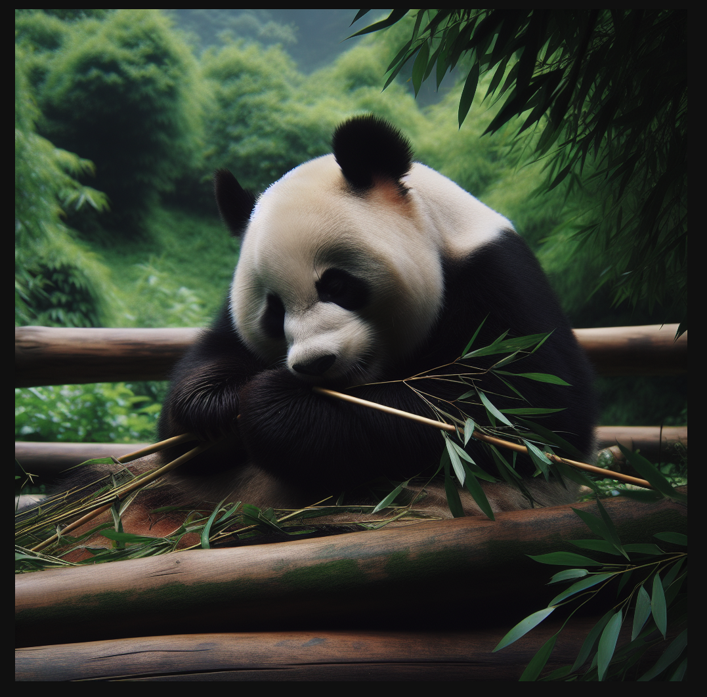

# OpenAI Images

# Models available :

---

- text to image :
    - dall-e-3
    - gpt-image-1

# CURL

---

## Request

```jsx
curl --location 'https://api.znapai.com/v1/images/generations' \
--header 'Content-Type: application/json' \
--header 'Authorization: $ZnapAI_API_KEY' \
--data '{
    "model": "dall-e-3",
    "prompt": "A panda eating bamboo",
    "n": 1,
    "size": "1024x1024"
  }'
```

## Response

```jsx
{
  "created": 1741510003,
  "data": [
    {
      "b64_json": null,
      "revised_prompt": "A panda peacefully feasting upon a stick of bamboo, its black and white fur contrasting against the surrounding lush greenery of its natural habitat.",
      "url": "URL_TO_IMAGE"
    }
  ],
  "usage": {
    "completion_tokens": 0,
    "prompt_tokens": 0,
    "total_tokens": 0,
    "completion_tokens_details": null,
    "prompt_tokens_details": null
  }
}
```

## Image


